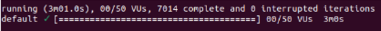
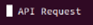
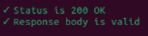
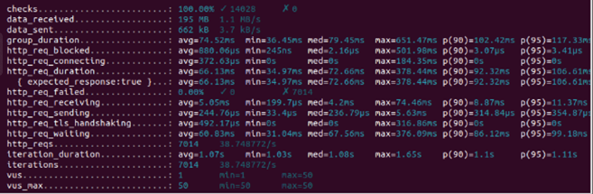

## Soal Eksplorasi
### 1. Tulis kesimpulan dari hasil pengujian berikut 
jawab : (gambar pada soal di Nation)

Kesimpulan :\
Gambar yang diberikan dalam notion tersebut menunjukan hasil dari pengujian beban yang digunakan untuk memahami kinerja sistem di bawah beban pengguna tertentu dengan pengujian dilakukan untuk API (API Testing). Hasil pengujian beban pada aplikasi atau sistem yang diberikan menunjukkan kinerja yang stabil dan efisien di bawah beban pengguna. Dalam durasi 3 menit dan 1 detik, dengan jumlah pengguna virtual bervariasi dari 0 hingga 50, sistem berhasil menyelesaikan 7014 iterasi tanpa kegagalan, menandakan keandalan sistem. Semua permintaan (200) ke API mendapat respons sukses (OK), dengan indikator kinerja utama seperti waktu durasi permintaan rata-rata 66.13 milidetik dan total 7014 permintaan HTTP berhasil dilakukan, menunjukkan responsifitas yang valid dan sesuai dari server terhadap beban permintaan.

Pengujian juga mengukur aspek lainnya seperti waktu blokir permintaan, koneksi, penerimaan respons, dan TLS handshaking, semuanya menunjukkan efisiensi dalam penanganan permintaan. Dengan jumlah pengguna virtual maksimum yang dikonfigurasikan mencapai 50, pengujian ini secara efektif menggambarkan bagaimana sistem berperilaku dan merespons di bawah kondisi penggunaan yang bervariasi, dengan memastikan semua kondisi dan pemeriksaan dalam skrip pengujian terpenuhi tanpa adanya kegagalan.

============================================================================================

Analisis :\
Pada bagian  ini menunjukan : 
- Pengujian ini dijalankan selama 3 menit dan 1 detik. Selama waktu tersebut, jumlah pengguna virtual (VUs) yaitu pengguna nyata yang melakukan permintaan ke sistem yang diuji untuk menilai bagaimana sistem tersebut merespons di bawah beban adalah bervariasi dari 0 hingga 50 dengan batas waktu maksimumnya "3m10s" atau 3 menit 1 detik yang diizinkan untuk satu siklus pengujian atau iterasi. -- Running (3m01.0s) / 00/50 VUs
- Selama pengujian, 7014 iterasi atau siklus lengkap dari skrip pengujian telah berhasil diselesaikan tanpa ada iterasi yang terganggu dan tidak ada iterasi yang terputus atau gagal, yang merupakan indikasi dari kestabilan sistem. -- 7014 complete / 0 interrupted iterations

Pada bagian  menunjukan bahwa pengujian dilakukan untuk API (API Testing). Kemudian, bagian  menunjukkan bahwa permintaan yang dikirim selama pengujian mendapatkan respons sukses dari server. Status HTTP 200 OK menandakan bahwa permintaan telah berhasil diproses dan server tidak hanya merespons, tetapi responsnya berisi data yang valid dan sesuai harapan.

Pada bagian  ini menunjukan :
- checks... 100.00% ✓ 14028 ✗ 0 berarti pemeriksaan yang ditetapkan dalam skrip pengujian yang memastikan bahwa kondisi tertentu terpenuhi. "✓ 14028" menunjukkan jumlah pemeriksaan yang berhasil, dan "✗ 0" menunjukkan tidak ada yang gagal.
- http_req_blocked... avg=880.06µs menunjukkan waktu rata-rata yang dihabiskan permintaan yang diblok oleh sistem pengujian sebelum dikirim (misalnya, oleh limitasi rate). Angka dalam mikrodetik (µs).
- http_req_connecting... avg=372.63µs yaitu rata-rata waktu yang dibutuhkan untuk melakukan koneksi TCP ke server.
- http_req_duration... avg=66.13ms menunjukan waktu rata-rata yang dibutuhkan untuk menyelesaikan satu permintaan HTTP, termasuk waktu tunggu server untuk merespons. Ini diukur dalam milidetik (ms).
- http_req_receiving... avg=5.05ms menunjukan waktu rata-rata untuk menerima respons dari server setelah permintaan selesai dikirim.
- http_req_sending... avg=244.76µs menunjukan waktu rata-rata yang dibutuhkan untuk mengirimkan permintaan HTTP ke server.
- http_req_tls_handshaking... avg=492.17µs menunjukan aktu rata-rata yang diperlukan untuk melakukan proses TLS handshake, jika menggunakan HTTPS.
- http_req_waiting... avg=60.83ms menunjukan waktu rata-rata dihabiskan menunggu respons dari server setelah koneksi sudah dibuat dan permintaan dikirim.
- http_reqs... 7014 merupakan jumlah total permintaan HTTP yang dibuat selama pengujian.
- iteration_duration... avg=1.07s menunjukan waktu rata-rata yang dibutuhkan untuk satu siklus lengkap dari skrip pengujian.
- iterations... 7014 merupakan jumlah siklus lengkap dari skrip pengujian yang berhasil dieksekusi.
- vus... 1 merupakan jumlah minimum pengguna virtual yang aktif pada satu waktu selama pengujian.
- vus_max... 50 merupakan jumlah maksimum pengguna virtual yang konfigurasi untuk digunakan dalam pengujian ini.
