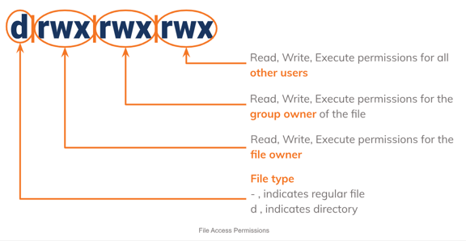
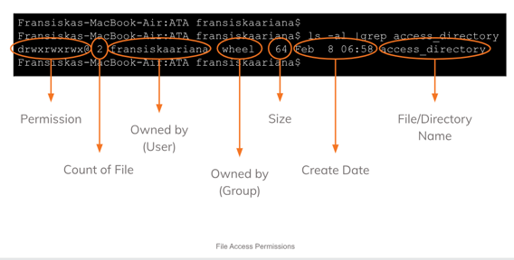

# (08) Linux Basic Commands

1. Command line adalah sebuah perintah yang dituliskan dalam bentuk text-based. Command line sangat useful karena command line lebih cepat daripada menggunakan GUI. Dengan menggunakan command line akan menggunakan resources yang lebih sedikit sehingga lebih efisien, commnad line lebih cocok untuk tugas yang sifatnya berulang, dan penggunaan command line sangat powerful.
2. Struktur dalam menuliskan command yaitu ```command [options] [parameters]```. Berbagai jenis commands yang bisa digunakan di linux di antaranya seperti basic commands ```(cal, date, etc.)```, file system commands ```(touch, ct, cp, mv, rm, mkdir, rmdir, cd, pwd, etc.)```, processes control commands ```(top, clear, history, etc.)```, utilities programs commands ```(ls, which, sudo, find, tree, etc.)```, file access permissions ```(chmod, chown, etc.)```. Format ketentuan penulisan untuk mengubah access permissions sebagai berikut.\
\

3. Shell adalah sebuah program yang pertindak sebagai jembatan antara user dengan kernel atau sistem operasi. Shell script adalah sebuah dasar pemrograman yang dicompile berdasarkan command line yang digunakan. Dengan memahami basic of shell akan memungkinkan dapat membuat sebuah program yang simple tetapi poweful. Dalam membuat shell script pastikan menentukan jenis shellnya terlebih dahulu contohnya ```#!/bin/sh``` dilanjutkan membuat rangkaian commandsnya, selanjutnya ketika mengeksekusi shell script tersebut pastikan sudah memiliki hak execute, jikalau belum maka jalankan terlebih dahulu command ```chmod +x '*.sh'```, setelahnya baru jalankan file untuk eksekusi shell script yang telah dibuat.