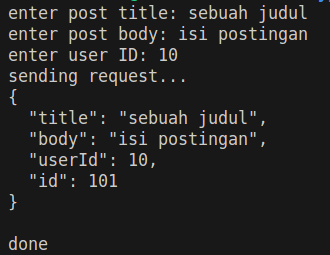

## Soal Eksplorasi 

1. Buatlah sebuah shell script untuk mengirim sebuah data dengan menggunakan REST API dengan kriteria sebagai berikut:
    1. API endpoint yang digunakan: https://jsonplaceholder.typicode.com/posts
    2. HTTP Method yang digunakan adalah POST.
    3. Request body dalam format JSON dengan contoh request body seperti berikut: 
        ```json
        {
        "title": "title",
        "body": "content",
        "userId": 1
        }
        ```
    
    4. Pengguna dapat memasukkan judul, body dan user ID.
    5. Contoh hasil akhir adalah seperti berikut:\
        