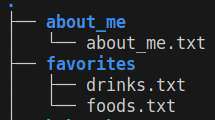
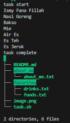
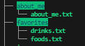

## Soal Prioritas 2

1. Buatlah sebuah shell script untuk menjalankan tugas berikut:
    1. Membuat dua folder yaitu about_me dan favorites.
    2. Di dalam folder about_me, buat sebuah file dengan nama about_me.txt dan diisi dengan nama lengkap.
    3. Di dalam folder favorites, buat 2 file yaitu food.txt dan drinks.txt.
    4. Di dalam file foods.txt diisi dengan makanan favorit.
    5. Di dalam file drinks.txt diisi dengan minuman favorit.
    6. Hasil akhir shell script seperti ini: 

Output dari shell script yang dijalankan :\
\
