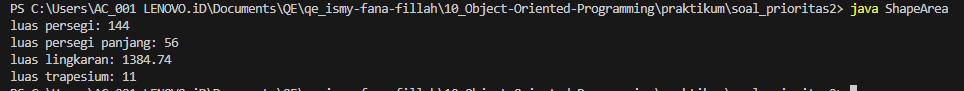

## Soal Prioritas 2

1. Buatlah sebuah program untuk menghitung luas berbagai bangun datar yaitu menghitung luas persegi, luas persegi panjang, luas trapesium dan luas lingkaran.Input angka berada pada fungsi utama dan fungsi operasi diletakkan terpisah dengan fungsi utama.
    
    Catatan: untuk perhitungan luas lingkaran gunakan nilai phi = 3.14
    
    **Input**
    
    `ShapeArea.getSquareArea(12)`
    
    `ShapeArea.getRectangleArea(7,8)`
    
    `ShapeArea.getCircleArea(21)`
    
    `ShapeArea.getTrapezoidArea(5,6,2)`
    
    **Output**
    
    `luas persegi: 144`
    
    `luas persegi panjang: 56`
    
    `luas lingkaran: 1384.74`
    
    `luas trapesium: 11`

### Output
